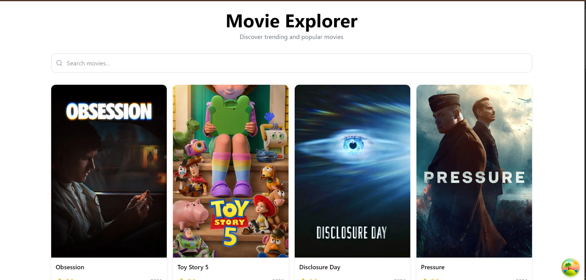
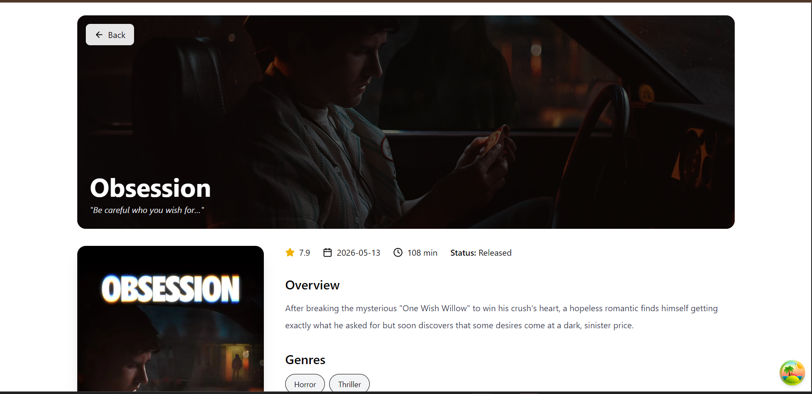

# 🎬 Movie Dashboard - TanStack Query

A modern movie discovery application built with React, TanStack Query, Tailwind CSS, and TMDB API.

This project explores real-world frontend data fetching patterns including caching, debounced search, infinite scrolling, prefetching, loading states, and query management using TanStack Query.

## Screenshots

### Home Page



### Movie Details Page



---

## 📸 Features

### Movie Discovery

* View trending movies
* Search movies by title
* Responsive movie grid layout
* Movie details page

### TanStack Query Concepts

* Query Keys
* Query Caching
* Stale Time
* Background Fetching
* Infinite Queries
* Prefetching
* Error Handling
* Loading States

### User Experience

* Debounced search input
* Infinite scrolling
* Loading skeletons
* Empty state handling
* Error state handling
* Responsive UI
* Movie detail prefetching on hover

---

## 🛠️ Tech Stack

### Frontend

* React
* Vite
* Tailwind CSS

### Data Fetching

* TanStack Query

### Routing

* React Router DOM

### API

* TMDB API

### Utilities

* Lucide React
* React Intersection Observer

---

## 📂 Project Structure

src

├── api

│   ├── client.js

│   ├── apiClient.js

│   └── movieApi.js

│

├── components

│   ├── EmptyState.jsx

│   ├── MovieCard.jsx

│   ├── MovieGrid.jsx

│   ├── MovieGridSkeleton.jsx

│   ├── MovieDetailsSkeleton.jsx

│   └── SearchBar.jsx

│

├── hooks

│   ├── useDebounce.js

│   ├── useInfiniteMovies.js

│   ├── useMovieDetails.js

│   └── useMovies.js

│

├── pages

│   └── MovieDetails.jsx

│

├── router

│   └── index.jsx

│

├── App.jsx

└── main.jsx

---

## ⚙️ Installation

Clone the repository

```bash
git clone https://github.com/Swethabura/movie-dashboard-tanstack-query.git
```

Navigate to the project

```bash
cd movie-dashboard-tanstack-query
```

Install dependencies

```bash
npm install
```

Create a .env file

```env
VITE_TMDB_API_KEY=YOUR_API_KEY
```

Start development server

```bash
npm run dev
```

---

## 🧠 What I Learned

Through this project I explored:

* TanStack Query fundamentals
* Query caching and stale data management
* Dynamic query keys
* Infinite scrolling patterns
* Debounced search implementation
* API request optimization
* Prefetching strategies
* Loading and error state management
* Scalable project structure

---

## 🔮 Future Improvements

* Trending categories
* Movie recommendations
* Watchlist functionality
* Theme switcher
* Advanced filters
* Search history

---

## 🙌 Acknowledgements

Movie data provided by TMDB.

Built for learning and exploring modern frontend data-fetching patterns using TanStack Query.
